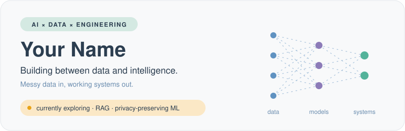
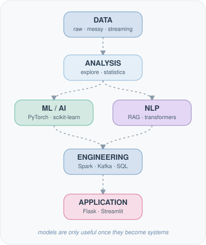
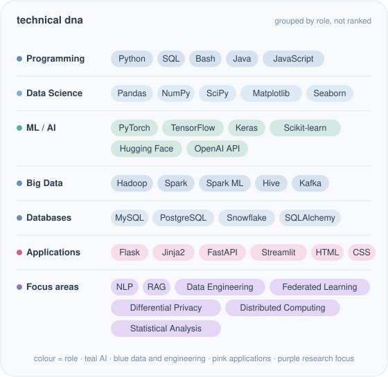
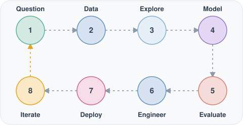

 

 

**I like turning messy data into useful systems.**

Most of my curiosity lives in the gaps: between a notebook and a pipeline,
between a model and a product, between a metric and a decision.
I'd rather understand the whole path than only the part that trains.

[how I think](#how-i-think) · [skill map](#skill-map) · [technical dna](#technical-dna) · [exploring](#currently-exploring) · [how I build](#how-i-build)

 

## how i think

Models are components. The interesting work starts when data, analysis, learning and
engineering have to behave like one system.

 

## skill map

<b>Dashboard view</b> · same data, as cards

Personal, self-assessed ratings. Not a benchmark.

 

## technical dna

<b>Text version</b> · expand for the plain list

 

**Programming** · `Python` `SQL` `Bash` `Java` `JavaScript`

**Data science** · `Pandas` `NumPy` `SciPy` `Matplotlib` `Seaborn`

**ML / AI** · `PyTorch` `TensorFlow` `Keras` `Scikit-learn` `Hugging Face` `OpenAI API`

**Big data** · `Hadoop` `Spark` `Spark ML` `Hive` `Kafka`

**Databases** · `MySQL` `PostgreSQL` `Snowflake` `SQLAlchemy`

**Applications** · `Flask` `Jinja2` `FastAPI` `Streamlit` `HTML` `CSS`

**Focus areas** · NLP · RAG · Data Engineering · Federated Learning · Differential Privacy · Distributed Computing · Statistical Analysis

 

## currently exploring

Open a line to read more. These are directions, not finished work.

<b>Exploring</b> · retrieval-augmented generation

 

How retrieval quality, context construction and evaluation shape whether a language-model
application can be trusted. Often more than the choice of model.

<b>Experimenting with</b> · NLP and language models

 

Turning unstructured text into structure and signal: embeddings, transformers,
and the unglamorous preprocessing in between.

<b>Learning</b> · distributed data processing

 

Spark, Kafka and the habits that keep a pipeline working when the data stops fitting on one machine.

<b>Interested in</b> · privacy-preserving ML

 

Federated learning and differential privacy: learning from data without having to collect all of it.

<b>Interested in</b> · intelligent applications

 

Wrapping models in interfaces (Streamlit, Flask, FastAPI) so they can be used, questioned and improved.

 

## how i build

The loop matters more than any single step. Evaluation and iteration are part of the build, not an afterthought.

 

<!--
OPTIONAL: live GitHub stats (real data only, generated by a public service).
Delete the comment markers to enable. Replace YOUR_USERNAME. If your activity is
low, leave this disabled; the profile works without it.

-->

data → intelligence → something useful

[LinkedIn](https://www.linkedin.com/in/YOUR_LINKEDIN_HANDLE) ·
[Email](mailto:YOUR_EMAIL@example.com) ·
[GitHub](https://github.com/YOUR_USERNAME)

